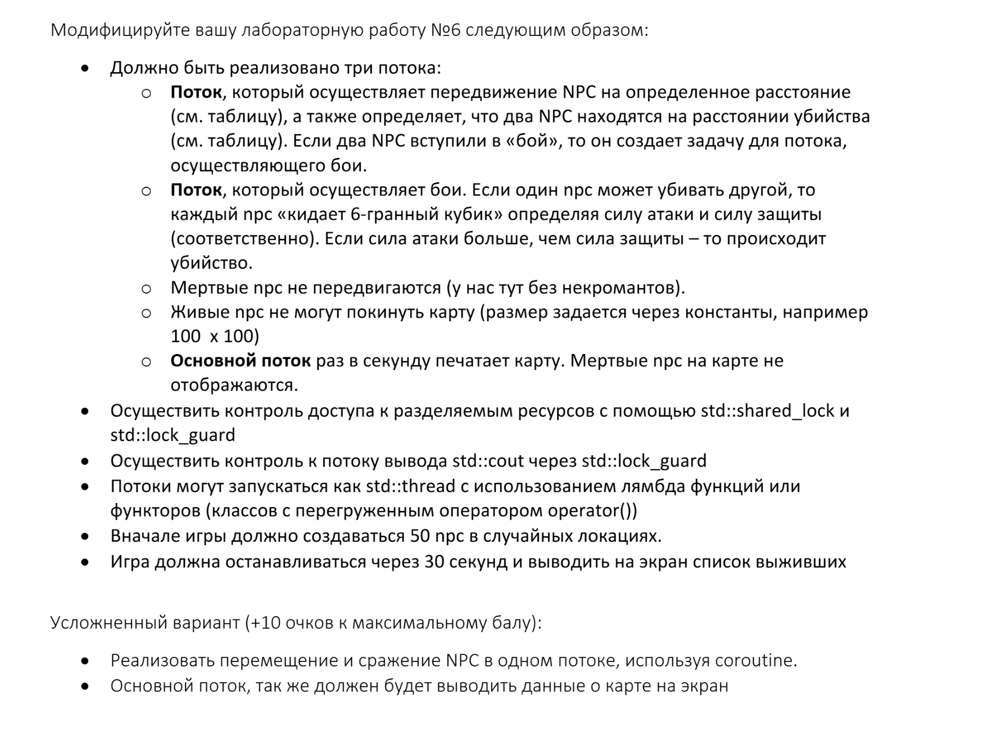

## Лабораторная работа №7. Дисциплина: ООП 

# Рыбин Владимир Викторович

## Вариант: 17

## Задание: 

| Кто нагоняет          | Расстояние хода | Расстояние убийства |
|-----------------------|-----------------|---------------------|
| **Странствующий рыцарь**  | 30              | 10                  |
| **Дракон**                | 50              | 30                  |
| **Жаба**                  | 1               | 10                  |

## Требования к заданию: 

